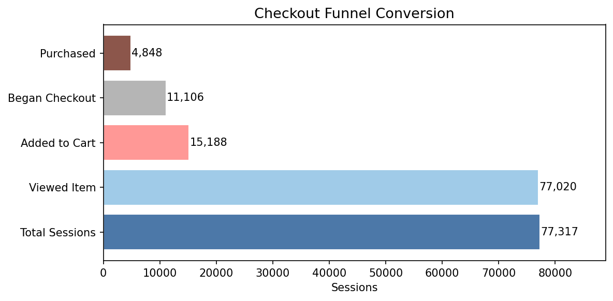
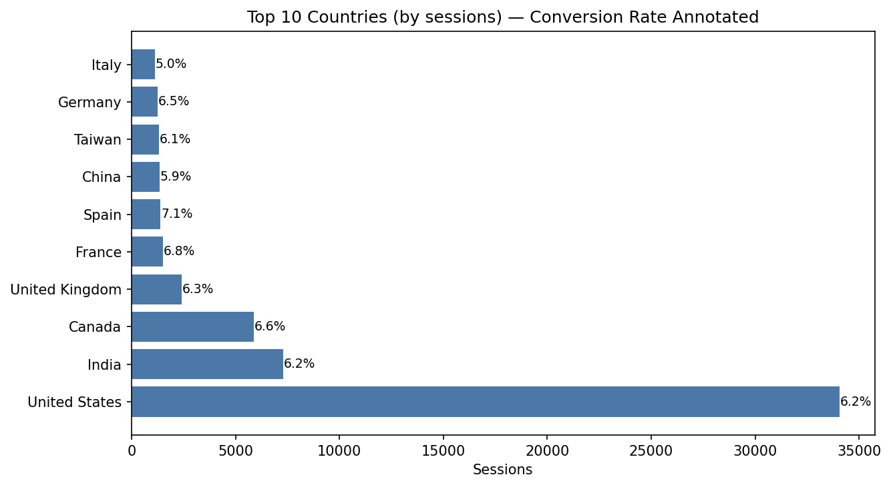
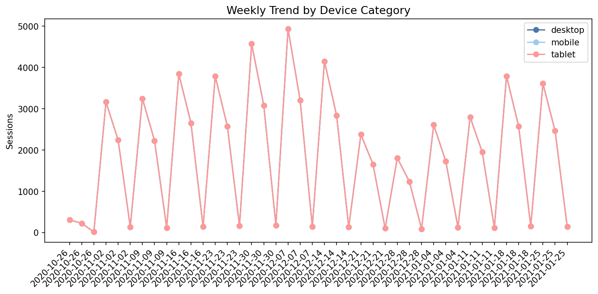
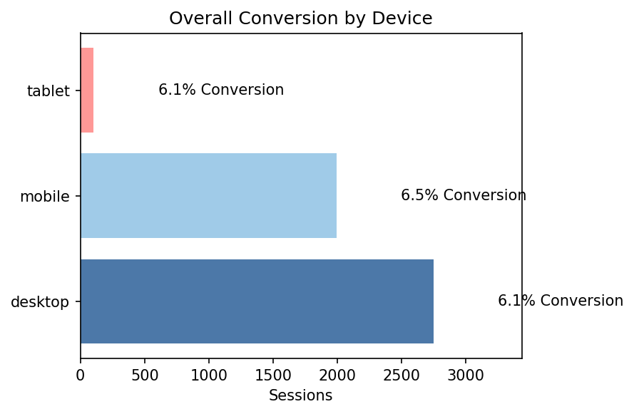

# Checkout Funnel Optimization — GA4 (BigQuery) × Excel × Power BI

Session-level funnel analysis of the Google Merchandise Store's GA4 event export:
where checkout friction actually shows up across countries and device categories,
and how it trends over a 3-month window.

## What this is

- **Data engineering:** raw GA4 event logs → unique user sessions → funnel-stage
  flags, built entirely in BigQuery SQL (`UNNEST`, CTEs, conditional aggregation).
  *Assessed Google Merchandise Store event data to identify checkout friction trends
  by reconstructing unique user sessions from 3 month logs using BigQuery SQL
  (UNNEST array flattening, CTEs and conditional aggregation).*
- **Validation:** the same segment counts independently re-derived in Excel and
  checked against the BigQuery output.
- **Delivery:** an interactive Power BI dashboard comparing checkout conversion by
  country and device category, built on DAX measures — not pre-baked SQL rates —
  so every number stays correct under any filter combination.
  *Designed an interactive Power BI dashboard to compare checkout conversion
  performance across countries and device categories, enabling identification of
  high-friction stages in the customer journey.*

## Funnel

```
view_item  →  add_to_cart  →  begin_checkout  →  purchase
```

## Data source

`bigquery-public-data.ga4_obfuscated_sample_ecommerce.events_*` — Google's public,
obfuscated GA4 export from the Google Merchandise Store. Covers 2020-11-01 to
2021-01-31 (92 daily tables). Free to query via BigQuery Sandbox, no credit card
required. See `docs/PROJECT_SPEC.md` §5 for access details and known limitations
of the obfuscated data.

## Results

Key visuals from the BigQuery output (2020-11-01 to 2021-01-31, 77,317 sessions):


*77,317 sessions → 77,020 viewed an item → 15,188 added to cart → 11,106 began checkout → 4,848 purchased (6.3% overall).*


*Indonesia 3.96% at 657 sessions is the clearest underperformer at usable volume.*


*December peak around the week of Dec 7 (~9.3% on desktop), then back to 4–6% in January.*


*Desktop 6.1%, mobile 6.5%, tablet 6.1% — device explains very little; the view→cart drop dominates everywhere.*

## Repo structure

```
sql/        BigQuery SQL — run in order: 01 → 02 → 03
excel/      Independent cross-check workbook + instructions
powerbi/    Dashboard build guide (data model, DAX, layout)
docs/       Full project spec + findings write-up
images/     Charts from the query output
```

## How to reproduce

1. In BigQuery, confirm the date window with `sql/03_data_quality_checks.sql`
   (Check 2), then set your real 3-month range at the top of `sql/01`.
2. Run `sql/01_session_and_funnel_flags.sql`; save the output as a table
   (e.g. `your_project.your_dataset.session_funnel_flags`).
3. Run `sql/02_segment_and_trend_summary.sql` against that table.
4. Run every check in `sql/03_data_quality_checks.sql` and note the results.
5. Export the query results as CSV and paste into
   `excel/Checkout_Funnel_Analysis_Template.xlsx` for the independent cross-check
   (instructions on its first tab).
6. Charts in `images/` are built from the same CSVs with Python/matplotlib.
7. Follow `powerbi/DASHBOARD_BUILD_GUIDE.md` to connect Power BI and build the
   dashboard.

Full spec, phase-by-phase plan, and done-criteria for each step:
[`docs/PROJECT_SPEC.md`](docs/PROJECT_SPEC.md).

## Status

- [x] Data pulled from BigQuery
- [x] Data quality checks run
- [x] Excel cross-check complete
- [x] Charts added to README
- [x] Findings written

*(Update this checklist as each step is actually completed — it's a more honest
signal to anyone reading the repo than a README that claims a finished project on
day one.)*

## License

MIT — see `LICENSE`.